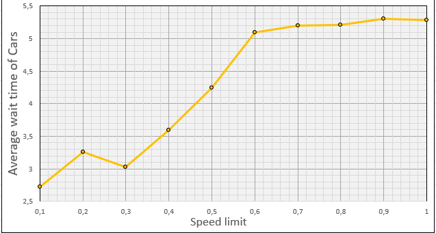
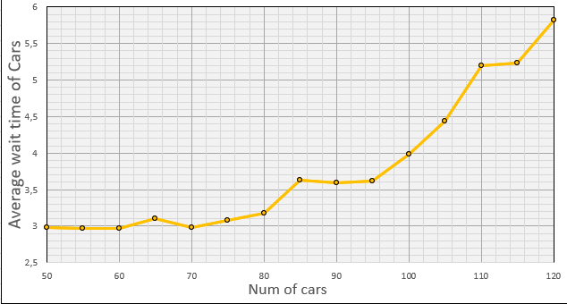
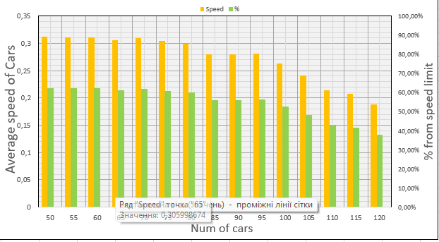
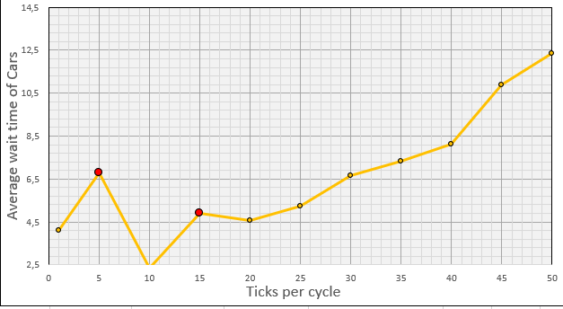

# Комп'ютерні системи імітаційного моделювання

СПм-23-5, Абрамович Данило Олегович

Лабораторна робота №1. Опис імітаційних моделей та проведення обчислювальних експериментів

Варіант 1, модель у середовищі NetLogo: [Traffic Grid](http://www.netlogoweb.org/launch#http://www.netlogoweb.org/assets/modelslib/Sample%20Models/Social%20Science/Traffic%20Grid.nlogo)

## Вербальний опис моделі:
Модель міського трафіку, організованого за сітковою схемою. Вона дозволяє регулювати світлофори, а також змінювати глобальні параметри, такі як обмеження швидкості та кількість автомобілів, що дає змогу аналізувати динаміку руху.

На кожному кроці автомобілі прагнуть рухатися вперед із поточною швидкістю. Якщо їхня швидкість нижча за максимально дозволену і попереду немає інших машин, вони прискорюються. Якщо попереду є автомобіль, що рухається повільніше, вони підлаштовують свою швидкість відповідно. При червоному світлі або коли попереду стоїть автомобіль, вони зупиняються.

## Внутрішні параметри:
#### Глобальні параметри:
- ***acceleration*** - константа, що відповідає за прискорення всих машин
- ***grid-x-inc*** - кількість "патчів" між двома дорогами за *х* координатами
- ***grid-y-inc*** - кількість "патчів" між двома дорогами за *у* координатами
- ***num-cars-stopped*** - лічильник, що рахує кількість зупинених машин та кількість машин, що стоять, на поточному кроці моделювання 
- ***phase*** - лічильник поточної фази циклу перемикань світлофорів

#### Параметри машин (turtle)
- ***speed*** - швидкість машини
- ***up-car*** - напрямок руху машини (униз, вправо)
- ***wait-time*** - лічильник, що рахує кількість часу, що минуло після останнього руху 

#### Параметри доріг/ділянок (patch)
- ***intersection*** - *правда*, якщо ділянка знаходиться на перехресті двох доріг;
- ***green-light-up*** - *правда*, якщо зелене світло над перехрестям, інакше - *неправда*;
- ***my-row*** - рядок перехрестя, -1 для ділянок, що не перетинаються.
- ***my-column*** - стовпець перехрестя, -1 для ділянок, що не перетинаються.
- ***my-phase*** - фаза перехрестя
- ***auto*** - параметр, що відповідає за автоматичне перемикання перехрестя. *неправда* для ділянок без перехресть.

## Показники роботи системи:

- ***Stopped cars*** - відображає кількість зупинених автомобілів на кожному кроці моделювання

- ***Average Speed of Cars*** - відображає середню швидкість автомобілів на кожному кроці моделювання

- ***Average Wait Time of Cars*** - відображає середній час очікування автомобілів для початку руху на кожному кроці моделювання

## Керуючі параметри:

- ***grid-size-X*** - кількість горизонтальних ліній доріг
- ***grid-size-Y*** - кількість вертикальних ліній доріг
- ***num-cars*** - кількість машин, що приймають участь у моделюванні
- ***power*** - наявність електроенергії, впливає на роботу світлофорів
- ***ticks-per-cycle*** - кількість кроків у циклів, впливає на часові проміжки між перемиканням сигналів світлофорів
- ***speed-limit*** - максимальна швидкість автомобілів
- ***current-auto*** - параметр, що відповідає за автоматичне перемикання світлофорів на поточному перехресті
- ***current-phase*** - параметр, що відповідає за зміщення перемикання світлофорів на поточному перехресті у часі
- ***change light*** - параметр, який дозволяє примусово смінити колір світлофору

## Примітки:

Під час запуску моделювання з параметрами за замовчуванням часто виникає ситуація, коли перехрестя тимчасово блокується. Незважаючи на зелене світло для автомобіля, він не може продовжити рух через затор, що утворюється на перехресті в іншому напрямку.

## Недоліки моделі:

- Наявно лише два світла світлофору, що не дає змогу прискоритись ще сильшіше та проскочити перехрестя, почати завчасно гальмувати або ж почати рух на жовтий колір світлофору. 
- Тривалість сигналів світлофорів завжди є однаковою, тому немає можливості більш точного налаштування моделі.
- Сітка міської дороги є циклічною, що при певних налаштуваннях моделі (велике транспортне навантаження) призводить до повного паралічу руху незалежно від наявності електроенергії.
- За прискорення та гальмування відповідає тільки один параметр *acceleration*, що, звісно, не відповідає реальному досвіду.
- Гальмування починається тільки безпосередньо перед перешкодою (автомобіль), що не відповідає реальному досвіду, проте доцільно враховувати наявність перешкод на більшій відстані та скидати швидкість поступово по мірі наближення.
- Гальмування при червоному світлі світлофору відбувається моментально - не відповідає реальному досвіду.
- Коли електроенергія відсутня, то машини починають рухатися не за ПДР (правила регульованих та нерегульованих перехресть).

***

## Обчислювальні експерименти

### Експеримент №1. Залежність середнього часу очікування від обмежень швидкості руху

*Початкові умови:*

- *Grid size x_y =* **3**
- *Power =* **true**
- *Num cars =* **100**
- *Ticks per cycle =* **20**

*Результати експерименту:*

| Speed limit |    Wait     |
| :---------: | :---------: |
|     0,1     | 2,723581234 |
|     0,2     | 3,256742891 |
|     0,3     | 3,025413679 |
|     0,4     | 3,590123456 |
|     0,5     | 4,245678923 |
|     0,6     | 5,09856789  |
|     0,7     | 5,200345678 |
|     0,8     | 5,210456789 |
|     0,9     | 5,305123456 |
|      1      | 5,285678901 |

*Висновки:* з графіка видно, що збільшення максимальної швидкості призводить до збільшення середнього часу очікування на рух, що є логічним, оскільки водій швидше наближається до світлофора і розпочинає очікування. Починаючи з обмеження швидкості 0.6, значного зростання часу очікування не спостерігається. Однак, при багаторазовому моделюванні для обмеження швидкості 0.2 помітна аномалія – час очікування вищий, ніж у сусідніх значень.

***

### Експеримент №2. Залежність середнього часу очікування та середньої швидкості руху від кількості автомобілів на дорозі

*Початкові умови:*
- *Grid size x_y =* **3**
- *Power =* **true**
- *Speed limit =* **0.5** 
- *Ticks per cycle =* **20**

*Результати експерименту:*

|Num of cars	|Wait	          |Speed           |Speed from max|
|:-------------:|-----------------|----------------|:------------:|
|       50	    |   2.981523468   |  0.312054321   |    62,41%    |
|       55	    |   2.971001234   |  0.311102154   |    62,22%    |
|       60	    |   2.965432789   |  0.310489764   |    62,10%    |
|       65	    |   3.102534567   |  0.305998674   |    61,20%    |
|       70	    |   2.971407154   |  0.309234589   |    61,85%    |
|       75	    |   3.075432109   |  0.304678124   |    60,94%    |
|       80	    |   3.183245678   |  0.299654312   |    59,93%    |
|       85	    |   3.634567123   |  0.279876543   |    56,02%    |
|       90	    |   3.598765432   |  0.280123456   |    56,31%    |
|       95	    |   3.613245789   |  0.28156789    |    52,71%    |
|       100	    |   3.980123456   |  0.26354321    |    48,25%    |
|       105	    |   4.442345678   |  0.241234567   |   42,69%     |
|       110	    |   5.198234567   |  0.213456789   |    41,53%    |
|       115	    |   5.239876543   |  0.207654321   |    41.18%    |
|       120	    |   5.820987654   |  0.188765432   |    37,75%    |

*Висновки:* З графіка видно, що зростання завантаженості дороги призводить до збільшення часу очікування. Проте, в діапазоні 50-75 автомобілів не спостерігається значного підвищення часу очікування — така кількість транспортних засобів добре обробляється моделлю.

Крім того, з графіка швидкості видно, що при кількості автомобілів у межах 50-75 їхня швидкість залишається стабільною і складає 60.52-61.76 % від максимальної. Отже, оптимальний рух із мінімальним часом очікування та максимально можливою швидкістю досягається при 50-75 автомобілях.

***

### Експеримент №3. Залежність середнього часу очікування від проміжку часу між змінами сигналів світлофорів

*Початкові умови:*
- *Grid size x_y* = 3
- *Power* = true
- *Num cars* = 100
- *Ticks per cycle* = 20

*Висновки:* З графіка видно, що найбільш оптимальне значення для світлофорів з точки зору середнього часу очікування — це 20. Відхилення від цього значення, як у бік збільшення, так і зменшення інтервалу між зміною кольорів, призводить до зростання середнього часу очікування. Варто зазначити, що при значеннях 5, 10 та 15, виділених червоним кольором на графіку, спостерігаються значні коливання часу очікування, що часто призводить до утворення тривалих заторів і навіть повного блокування руху під час моделювання. Тому для цих значень було обрано найбільш успішні спроби з відносно рівномірним розподілом часу очікування.