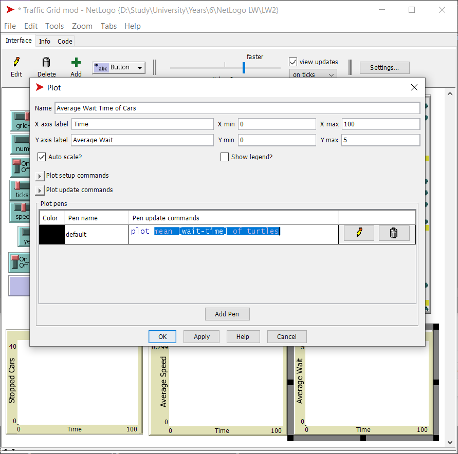
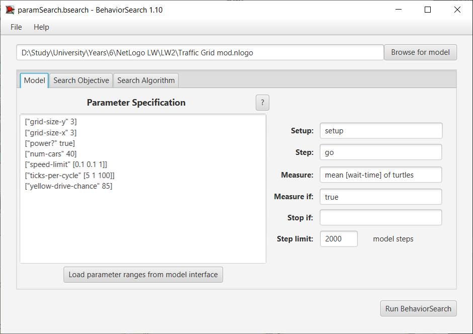
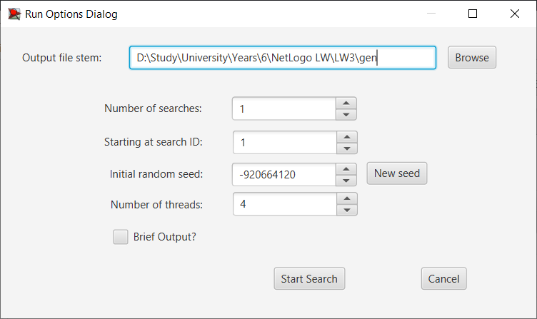
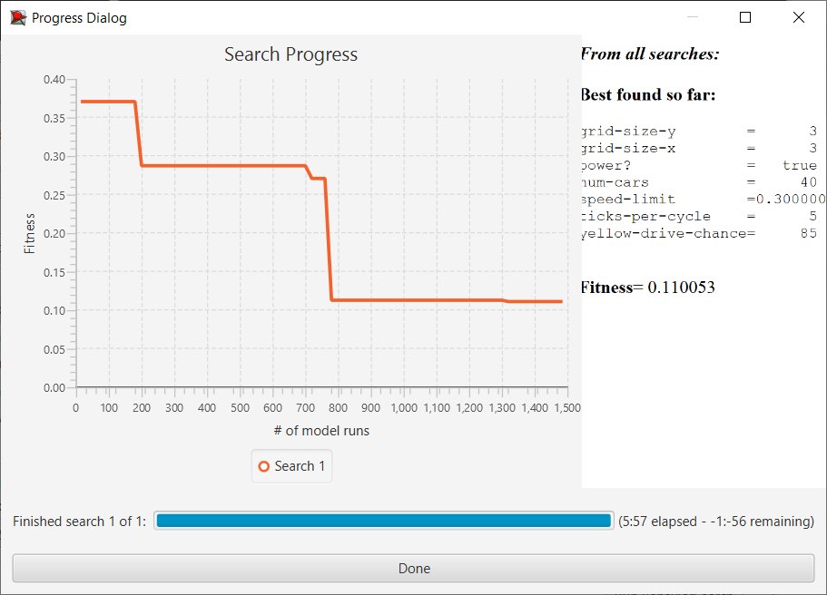
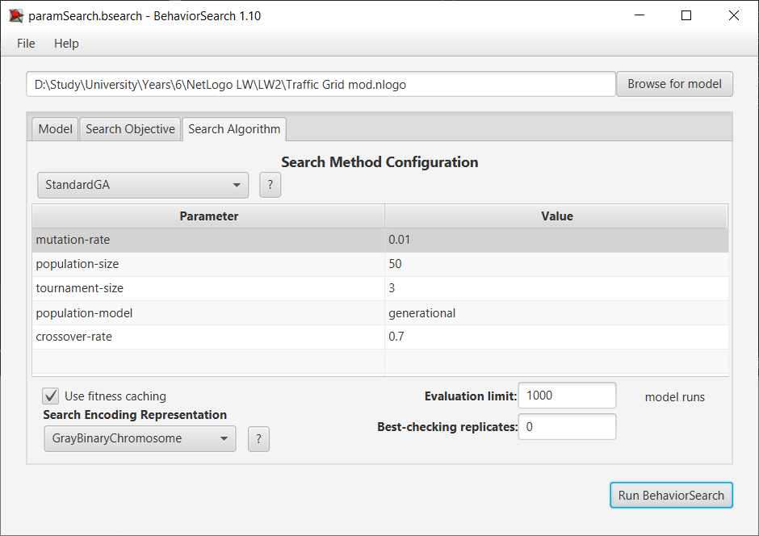
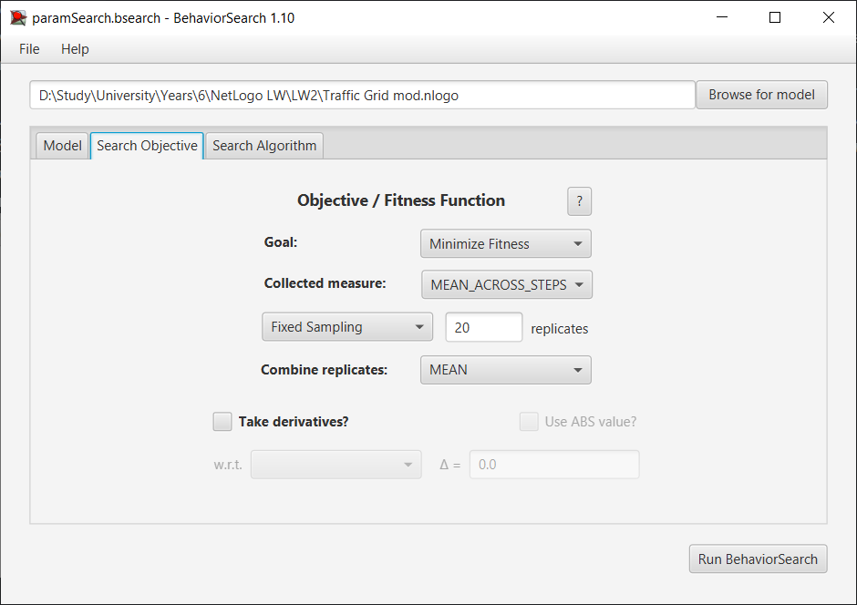
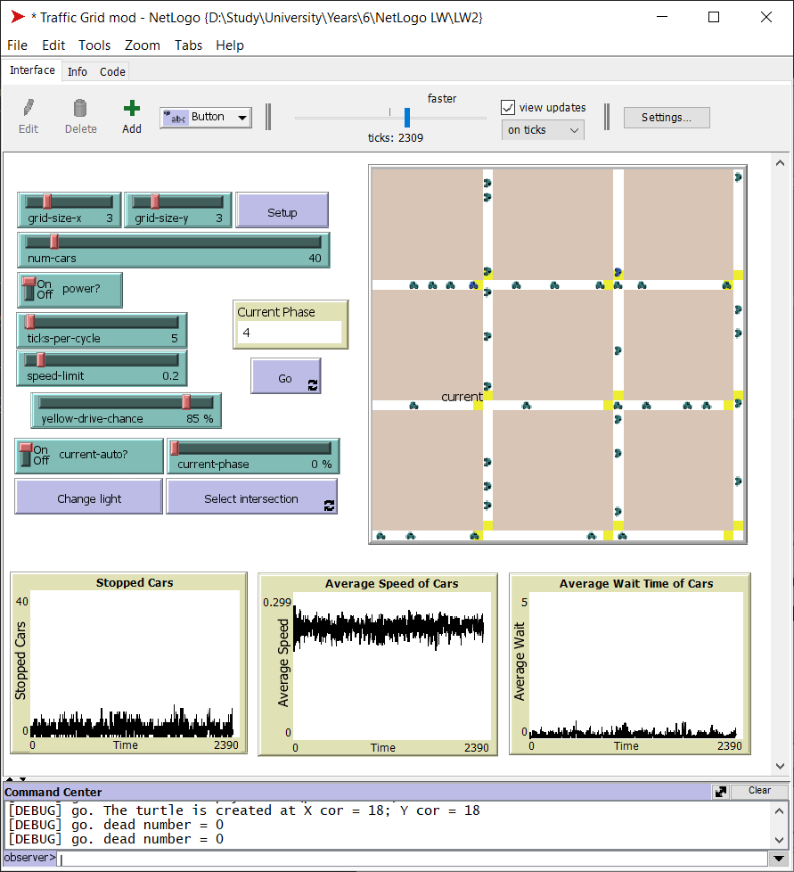

# Комп'ютерні системи імітаційного моделювання

СПм-23-5, Абрамович Данило Олегович

Лабораторна робота №3. Використання засобів обчислювального интелекту для оптимізації імітаційних моделей

Варіант 1, модель у середовищі NetLogo: [Traffic Grid](http://www.netlogoweb.org/launch#http://www.netlogoweb.org/assets/modelslib/Sample%20Models/Social%20Science/Traffic%20Grid.nlogo)

Вербальний опис обраної моделі знаходиться у [1 лабораторній роботі](/LW1/Laboratory_1.md#Вербальний-опис-моделі).

## Налаштування середовища BehaviorSearch

Параметри моделі (вкладка Model):

</br>["grid-size-y" 3]
</br>["grid-size-x" 3]
</br>["power?" true]
</br>["num-cars" 40]
</br>["speed-limit" [0.1 0.1 1]]
</br>["ticks-per-cycle" [5 1 100]]
</br>["yellow-drive-chance" 85]

Використовувана міра:
У якості цільової функції було обрано значення середнього часу очікування машин до початку руху, вираз для її розрахунку взято з налаштувань графіка аналізованої імітаційної моделі в середовищі NetLogo 



та вказано у параметрі "Measure":

``` NetLogo
mean [wait-time] of turtles
```

Середній час очікування всіх автомобілів розраховується як середнє значення за весь період симуляції, наприклад, тривалістю 2000 тактів (оскільки на кожному такті є своє значення поточної середньої швидкості всіх учасників дорожнього руху), починаючи з нульового такту симуляції.

Параметр *"Measure if"* має значення *true*, оскільки нас цікавить кожне значення цього показника.

Параметр зупинки за умовою *"Stop if"* не був використаний.

Загальний вигляд вкладки налаштувань параметрів моделі:


## Результати використання BehaviorSearch



Результат пошуку параметрів імітаційної моделі, використовуючи генетичний алгоритм:



## Налаштування алгоритму пошуку (вкладка Search Algorithm):

Загальний вид вкладки налаштувань алгоритму пошуку:




Результат пошуку параметрів імітаційної моделі, використовуючи випадковий пошук:


## Налаштування цільової функції (вкладка Search Objective):

Метою налаштування параметрів імітаційної моделі, що описує дорожній рух, є зменшення середнього часу очікування перед початком руху, що зазначено параметром *"Goal"* зі значенням *Minimize Fitness*. Іншими словами, необхідно підібрати такі параметри моделі, за яких автомобілі здійснюють найменшу кількість зупинок. При цьому нас цікавить середній час очікування за весь період симуляції (2000 кроків), як зазначено на попередній вкладці. Для цього в параметрі *"Collected measure"*, який визначає спосіб обчислення обраного показника, встановлено значення *MEAN_ACROSS_STEPS*.

Щоб уникнути спотворення результатів через випадкові значення, що використовуються в логіці самої моделі, кожна симуляція виконується 20 разів, а результуюче значення визначається як середнє арифметичне.

Загальний вигляд вкладки налаштувань цільової функції:




## Перевірка результатів


