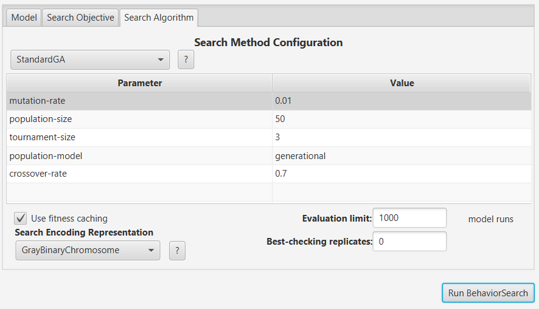

# Комп'ютерні системи імітаційного моделювання

СПм-23-5, Абрамович Данило Олегович

Лабораторна робота №3. Використання засобів обчислювального інтелекту для оптимізації імітаційних моделей

Варіант 1, модель у середовищі NetLogo: [Traffic Grid](http://www.netlogoweb.org/launch#http://www.netlogoweb.org/assets/modelslib/Sample%20Models/Social%20Science/Traffic%20Grid.nlogo)

Вербальний опис обраної моделі знаходиться у [1 лабораторній роботі](/LW1/Laboratory_1.md#Вербальний-опис-моделі).

## Налаштування середовища BehaviorSearch

Параметри моделі (вкладка Model):

</br>["grid-size-y" 3]
</br>["grid-size-x" 3]
</br>["power?" true]
</br>["num-cars" 40]
</br>["speed-limit" [0.1 0.1 1]]
</br>["ticks-per-cycle" [5 1 100]]
</br>["yellow-drive-chance" 85]

Використовувана міра:
У якості міри ефективності було обрано середній час очікування машин до початку руху. Формула для його розрахунку взята з параметрів графіка, налаштованого в аналізованій імітаційній моделі середовища NetLogo.


та вказано у параметрі "Measure":

``` NetLogo
mean [wait-time] of turtles
```

Середній час очікування розраховувався на основі значень для всіх машин протягом усього періоду симуляції, наприклад, 2000 тактів. На кожному такті враховувалася поточна середня швидкість усіх учасників дорожнього руху, починаючи з 0 такту.
Параметр "Measure if" встановлено в значення true, оскільки для аналізу необхідно враховувати кожне значення показника.
Параметр зупинки за умовою "Stop if" не використовувався в даній моделі.
Загальний вигляд вкладки налаштувань параметрів моделі:


## Налаштування цільової функції (вкладка Search Objective):

Метою підбору параметрів імітаційної моделі, яка описує дорожній рух, є мінімізація середнього часу очікування машин перед початком руху. Ця мета задається через параметр "Goal" зі значенням Minimize Fitness. Завдання полягає у визначенні таких параметрів налаштувань моделі, при яких машини здійснюють найкоротші зупинки.
Середній час очікування розраховується за всю тривалість симуляції, що складає 2000 тактів (вказано у попередніх налаштуваннях). Для цього у параметрі "Collected measure", який визначає спосіб збору даних обраного показника, встановлено значення MEAN_ACROSS_STEPS.
Для уникнення викривлення результатів через випадкові значення, що застосовуються в логіці імітаційної моделі, кожна симуляція повторюється 20 разів. Підсумкове значення розраховується як середнє арифметичне отриманих результатів.
Загальний вигляд вкладки налаштувань цільової функції:


## Налаштування алгоритму пошуку (вкладка Search Algorithm):

Загальний вид вкладки налаштувань алгоритму пошуку:



## Результати використання BehaviorSearch


Результат пошуку параметрів імітаційної моделі, використовуючи генетичний алгоритм:


Результат пошуку параметрів імітаційної моделі, використовуючи випадковий пошук:


## Перевірка результатів


